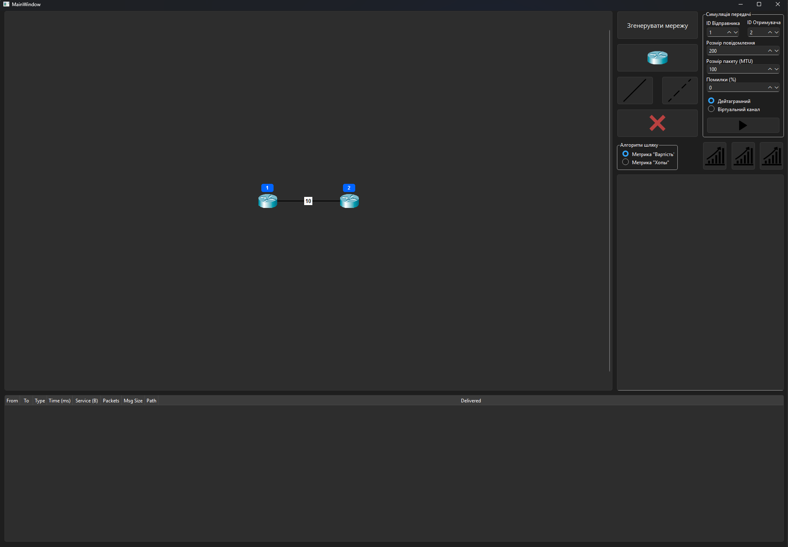
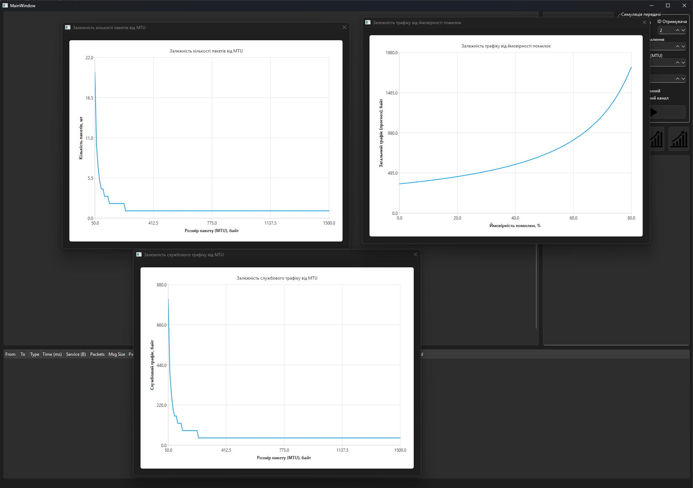

# Network Routing Simulator

A powerful visualization tool for simulating data packet routing in complex network topologies based on Link-State algorithms.

## Overview

This project simulates the operation of a computer network consisting of multiple regions. It visualizes the pathfinding process using **Dijkstra's Algorithm** and analyzes network performance under different conditions (MTU size, error rates, connection types).

The application allows users to build custom topologies, send packets between nodes, and observe the routing process in real-time with animated packet transmission.

## Key Features

* **Topology Generation:** Automatically generates a 3-region network structure (27+ nodes) or allows manual creation.
* **Routing Algorithms:**
    * Dijkstra's Algorithm (Shortest Path).
    * Metrics support: Link Cost (Weight) vs. Hop Count.
* **Transmission Modes:**
    * **Datagram Mode:** Fast, connectionless packet switching.
    * **Virtual Circuit:** Reliable connection-oriented transmission (Handshake -> Data -> Disconnect).
* **Real-time Simulation:**
    * Visual packet movement animation.
    * Packet loss simulation and ARQ (Automatic Repeat Request) retransmission.
    * Support for Duplex and Half-Duplex links.
* **Analytics:**
    * Detailed logs of transmission events.
    * Graphs for analyzing Service Traffic vs. MTU and Error Rate impact.

## Tech Stack

* **Language:** C++
* **Framework:** Qt 6 (Widgets, Charts, Core, Gui)
* **Build System:** CMake / QMake

## Gallery

### 1. Packet Transmission Simulation
Visual representation of packets traveling through the network.

### 2. Traffic Analysis
Built-in charts to analyze the efficiency of different MTU sizes.

## Documentation

For a detailed explanation of the algorithms and research results, please refer to the [Project Report (PDF)](docs/Report.pdf).

---
*This project was developed as a Course Work for the "Computer Networks" discipline.*